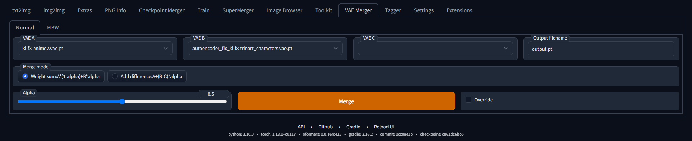

# stable-diffusion-webui vae merger

A WebUI extension for merging VAE

> **Note**
> I'm not sure if the implementation is correct or effective.

# Usage

## Normal merge


|||
|-|-|
|VAE A, VAE B, VAE C|VAE used for merging|
|Output filename|File name for saving the merged VAE. It will be saved in `models/VAE` or the directory specified by `--vae-dir`.|
|Merge mode|Expression used for merging|
|Override|Overwrite the VAE if it already exists.|


## Each key merge


You can change the alpha of each key by moving the slider.

### specify in more detail
All alphas are passed in json format.

Prefer the weight of the longest key whose beginning matches.

For example

```json
{
    "encoder.down.0.block.0.norm1.weight": 0.5,
    "encoder.down.0": 0.3,
    "encoder.mid.block_1": 0.7
}
```

In this case, 0.5 for `encoder.down.0.block.0.norm1.weight`, 0.3 for keys starting with `encoder.down.0`, and 0.3 for keys starting with `encoder.mid.block_1`. 0.7 is used, otherwise the `base alpha` value is used.