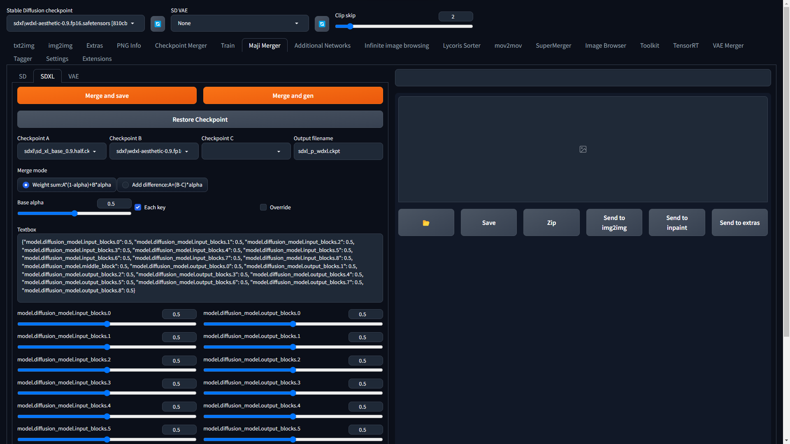

# maji merger

A WebUI extension for model merging

# Supported models
- VAE
- Stable Diffusion v1, v2
- Stable Diffusion XL

# Usage



You can change the alpha of each key by moving the slider.

All alphas are passed in json format.

Prefer the weight of the longest key whose beginning matches.

For example

```json
{
    "model.diffusion_model.input_blocks.0.0.weight": 0.5,
    "model.diffusion_model.input_blocks.1": 0.3,
    "model.diffusion_model.middle_block": 0.7
}
```

In this case, 0.5 is used for keys with `model.diffusion_model.input_blocks.0.0.weight`, 0.3 for keys starting with `model.diffusion_model.input_blocks.1`, and 0.7 for keys starting with `model.diffusion_model.middle_block`. Otherwise the "base alpha" value is used.